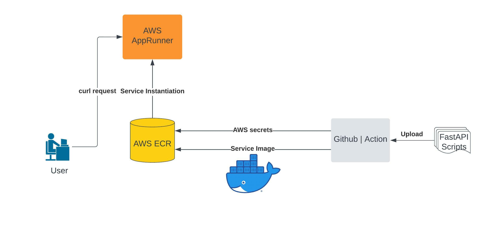

[](https://github.com/nogibjj/CD_API_AWS/actions/workflows/api_cicd.yml)
# CD_API_AWS
This is Qiheng's repo for IDS 706 Project 4: Continuous Delivery of Flask/FastAPI Data Engineering API on AWS.
&nbsp;
## Overview
In this project, we design an API for text preprocessing / normalization using FASTAPI, and make it automatically deploy and continuously running on AWS. We believe the text preprocessing / normailization is an important step in the Natural Language Processing, and we incorporate the funtionality with microservices, API, Continuous Delievery and Cloud Computing.
&nbsp;
## Project Structure

&nbsp;
## Usage
This preprocess API would replace target regions to a generalized tocken.

Supported text process operations:

lower letters, remove puctuation, replace numerical value / phone number / email
```
curl -X 'GET' \
  'https://p4nvpzmmif.us-east-1.awsapprunner.com/preprocess/' \
  -H 'accept: application/json' \
  -H 'Content-Type: application/json' \
  -d '{
  "text": "text_to_process",
  # operation can be included: "lower", "remove_punkt", "replace_number_like", "replace_phone", "replace_email"
  "steps": [
    
  ]
}'
```
1. Lower text
```
# Request
curl -X 'GET' \
  'https://p4nvpzmmif.us-east-1.awsapprunner.com/preprocess/' \
  -H 'accept: application/json' \
  -H 'Content-Type: application/json' \
  -d '{
  "text": "string HAS CAP LETTER",
  "steps": [
    "lower"
  ]
}'

# Response
{"steps":["lower"],"text":"string HAS CAP LETTER","preprocessed_text":"string has cap letter"}
```

2. Remove numerical value
```
# Request
curl -X 'GET' \
  'https://p4nvpzmmif.us-east-1.awsapprunner.com/preprocess/' \
  -H 'accept: application/json' \
  -H 'Content-Type: application/json' \
  -d '{
  "text": "string has number like 123 and 345",
  "steps": [
    "replace_number_like"
  ]
}'

# Response
{"steps":["replace_number_like"],"text":"string has number like 123 and 345","preprocessed_text":"string has number like  <NUMERIC_VALUE> and  <NUMERIC_VALUE> "}
```